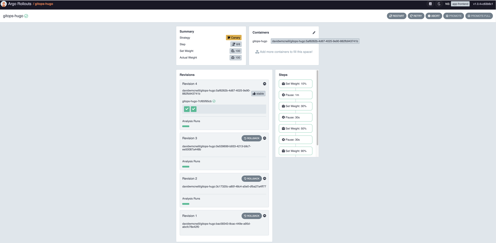
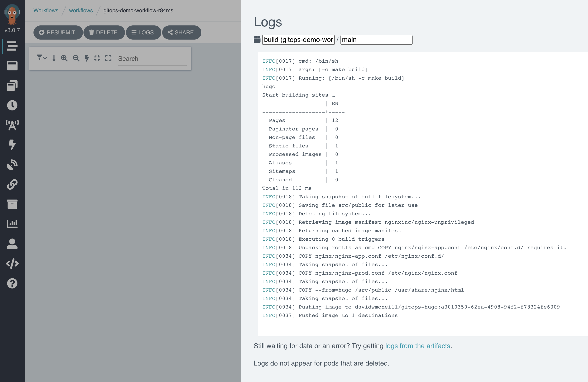
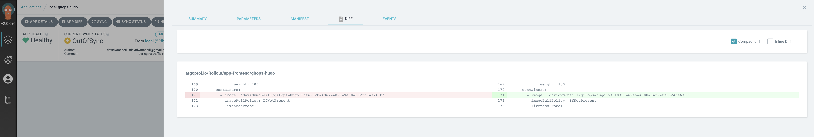
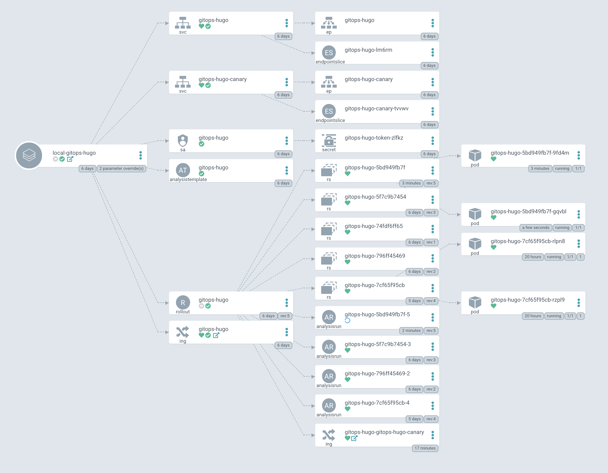
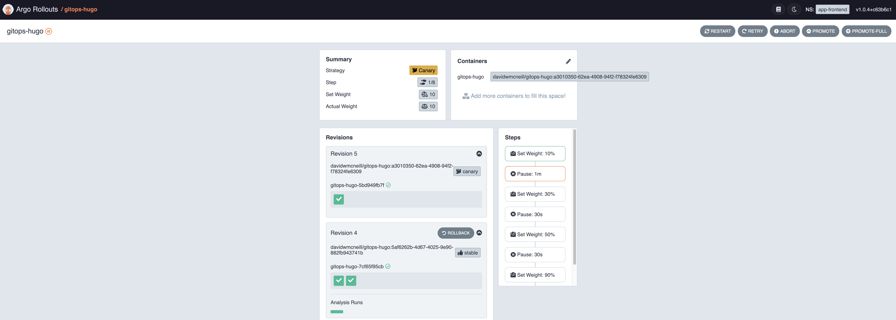
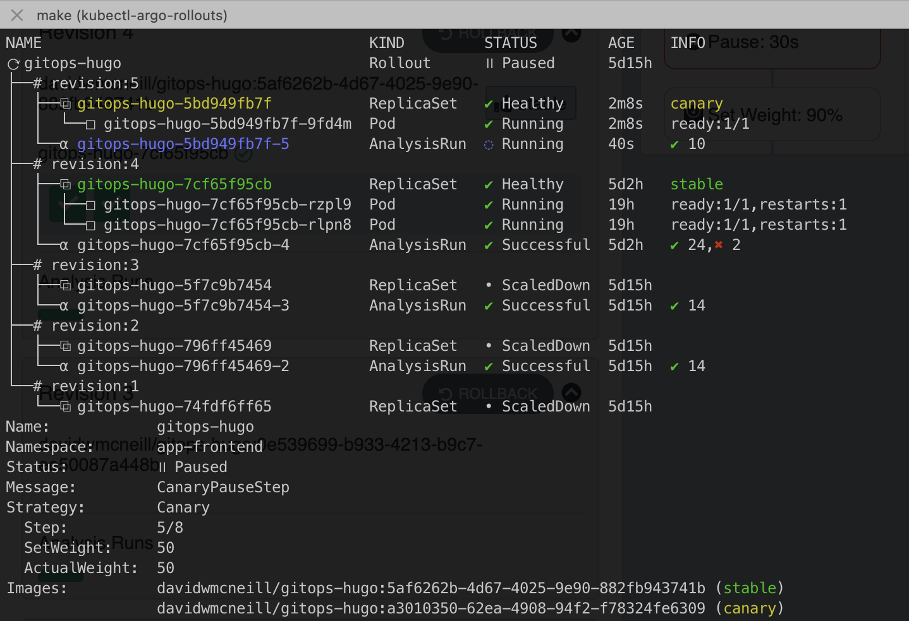
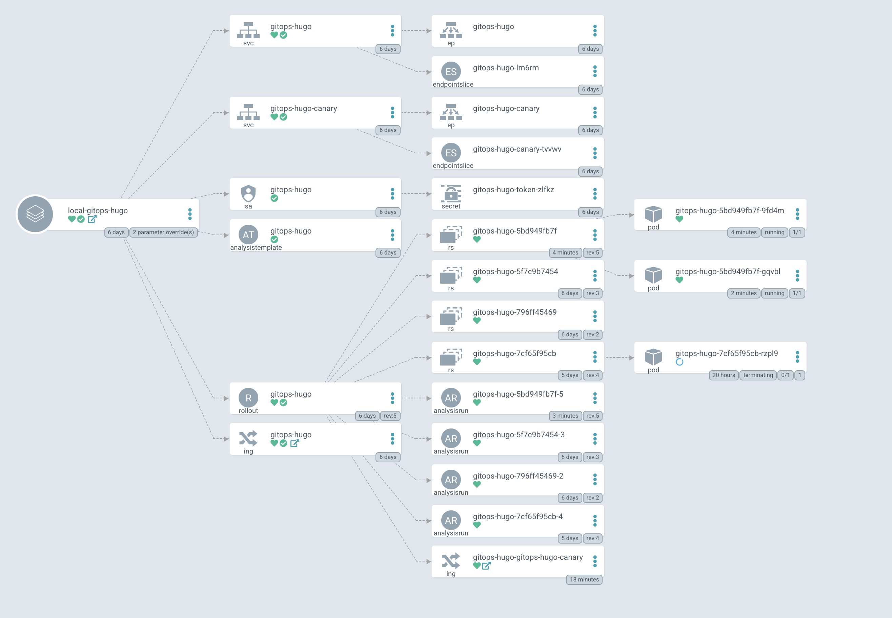
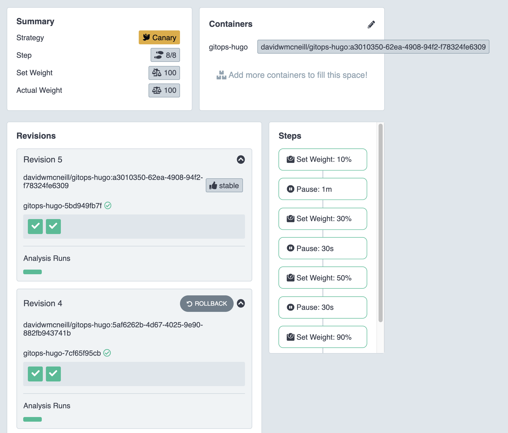
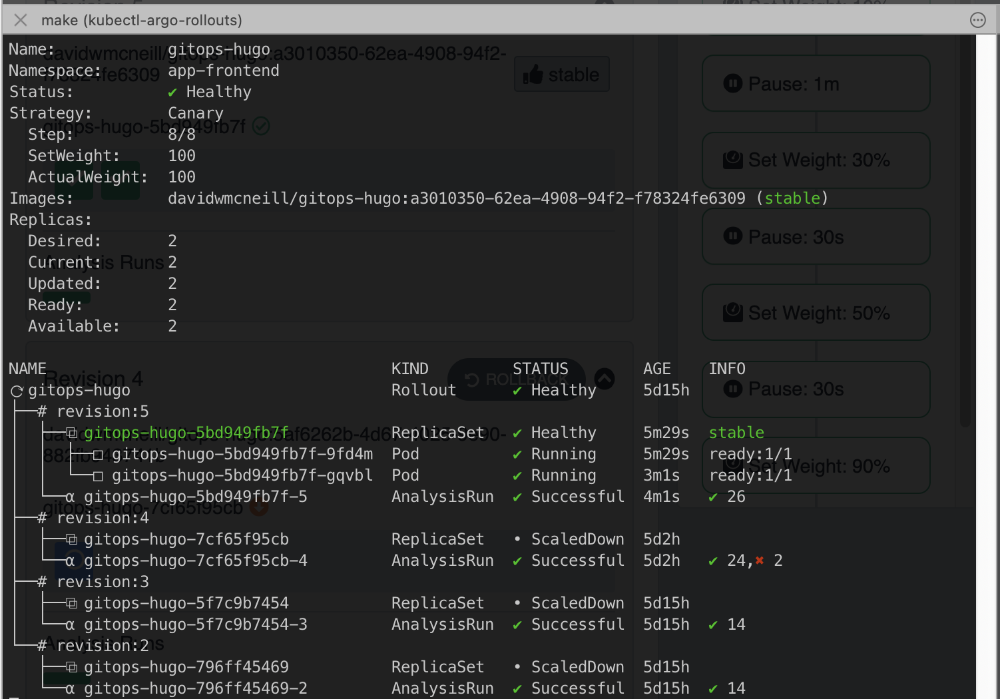

# What is progressive delivery?
There are various definitions of 'progressive delivery' so I'll go with the one I find to be the most concise via [devopsinsitute](https://www.devopsinstitute.com/progressive-delivery/)

> Progressive delivery is the process of pushing changes to a product iteratively, first to a small audience and then to increasingly larger audiences to maintain quality control. Progressive Delivery is a modified version of Continuous Delivery

There are a few options for implementing progressive delivery within a kubernetes cluster (see also [flagger](https://flagger.app/)). In this post I'll be using [Argo rollouts](https://argoproj.github.io/argo-rollouts/).

# Overview
In short, Argo rollouts can be used as a replacement for the 'Deployment' resource in Kubernetes to support more advanced deployment techniques than what is supported natively. [Here](https://argoproj.github.io/argo-rollouts/#what-is-argo-rollouts) is a full explanation.

For this post, I'm going to use the [canary analysis](https://argoproj.github.io/argo-rollouts/concepts/#canary) rollout option, utilizing metrics from Prometheus to determine if the deployment to the new version should continue.

This will all run within a K3d cluster and all the configuration details can be found [here](https://github.com/davidwmcneill/gitops-playground-apps)

# Overall Process
The full end to end process will run as follows:
- I'll push a change to my [demo application](https://github.com/davidwmcneill/gitops-hugo) to simulate a new build
- As the K3d cluster has no external endpoint to receive a git update webhook, I have an argo events endpoint that can be triggered locally:
```al
curl -X POST -H "Content-Type: application/json" -d '{"message":"build something"}' http://localhost:8080/demo-build-webhook
```
- This will kickoff the build in Argo Workflows - checkout the code repo, build a new docker image and push it to dockerhub
- Using [ArgoCD Image Updater](https://argocd-image-updater.readthedocs.io/en/stable/) the newly available image tag will be detected and trigger the rollout to begin (#TODO: For now I'll set the new image tag as an ArgoCD parameter, but in future would look to use the git option as best practice)
- The rollout will begin......


# Rollout Process
The rollout will use an [analysis template](https://argoproj.github.io/argo-rollouts/features/analysis/#background-analysis) to query the success of 2 metrics (part of the [4 golden signals](https://sre.google/sre-book/monitoring-distributed-systems/)):
- **Latency**: To ensure the requests are being processed in an acceptable duration:
```al
{{`sum(irate(nginx_ingress_controller_request_duration_seconds_sum{ exported_service="{{args.service-name}}"}[2m])) / sum(irate(nginx_ingress_controller_request_duration_seconds_count{ exported_service="{{args.service-name}}"}[2m]))`}}
```
- **Errors**: To ensure the measure of successful requests (http 2xx) is within an required range:
```al
{{`sum(irate(nginx_ingress_controller_requests{ exported_service="{{args.service-name}}",status=~"2.*"}[2m])) / sum(irate(nginx_ingress_controller_requests{ exported_service="{{args.service-name}}"}[2m]))`}}
```

The [Helm templated strategy](https://github.com/davidwmcneill/gitops-playground-apps/blob/main/helm/stack/gitops-hugo/templates/deployment.yaml#L102) for the rollout will be defined as:
```al
  strategy:
    canary:
      canaryService: {{ include "fullname" . }}-canary
      stableService: {{ include "fullname" . }}
      steps:
      - setWeight: 10
      - pause: {duration: 1m}
      - setWeight: 30
      - pause: {duration: 30s}
      - setWeight: 50
      - pause: {duration: 30s}
      - setWeight: 90
      - pause: {duration: 30s}
      analysis:
        templates:
        - templateName: {{ include "fullname" . }}
        startingStep: 2
        args:
        - name: service-name
          value: {{ include "fullname" . }}
```
Starting at step 2, the analysis will run every 30 seconds and based on the collected metrics either continue to rollout and increase the traffic through the new revision of the application, or if the analysis success criteria is not met, the rollout will be 

The [Nignx Ingress Controller](https://argoproj.github.io/argo-rollouts/features/traffic-management/nginx/) will be used as the traffic manager to split the traffic between the stable ingress and the new canary ingress.

# Monitoring the rollout
Argo Rollouts offers a [kubectl plugin](https://argoproj.github.io/argo-rollouts/features/kubectl-plugin/) to allow monitoring of the rollout via the cli.
There is also a dashboard that can be enabled via the [Argo rollouts helm chart](https://github.com/argoproj/argo-helm/blob/master/charts/argo-rollouts/values.yaml)

The dashboard can be accessed via port-forward:
```al
kubectl port-forward -n argo service/argo-rollouts-dashboard 31000:3100
```
#TODO: See if this can be setup on a path based ingress

From a browser: http://localhost:31000/rollouts

I encountered some issues with not being able to switch the namespace in the dashboard. There are some issue tickets raised around this. It might just be the dashboard version set in the helm chart. The alternative option is to use the rollouts plugin binary to open the dashboard passing in the namespace:
```al
kubectl argo rollouts dashboard -n app-frontend
```
From a browser: http://localhost:3100/rollouts

The status of the rollout for the demo can be seen



Generate some test traffic:
```al
while true; do curl -I "http://localhost:8080/gitops-hugo"; sleep 0.5; done
```

And trigger a build. Once the Kaniko build completes and pushes to Dockerhub, 'ArgoCD image updater' should detect the new image available for release



Once detected we will see the image tag diff in the Argocd deployment. i.e. The current image and the one that will be rolled out



# The rollout begins

As the rollout progresses we can see how argo rollouts manages the ingress traffic between the 2 services








Finally at the end of the rollout, the canary release is updated to stable and the previous release revision pods are terminated








All the configuration and tools used in this deployment can be found in the local branch on this [github repo](https://github.com/davidwmcneill/gitops-playground-apps)

# References
- https://argoproj.github.io/argo-rollouts/
- https://github.com/argoproj/argo-helm/tree/master/charts/argo-rollouts
- https://blog.argoproj.io/introducing-argo-rollouts-v1-0-803e87f76ef7
- https://www.youtube.com/watch?v=XNXJtxkUKeY
