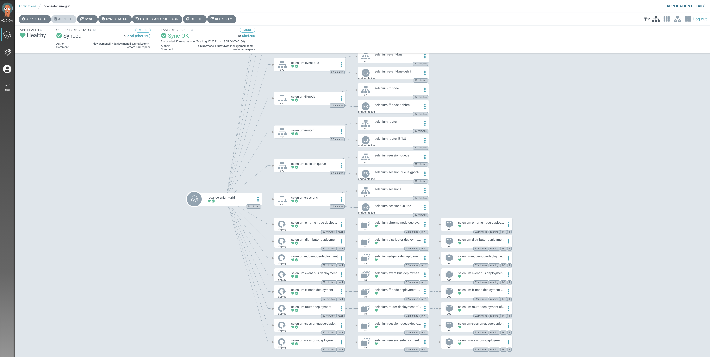
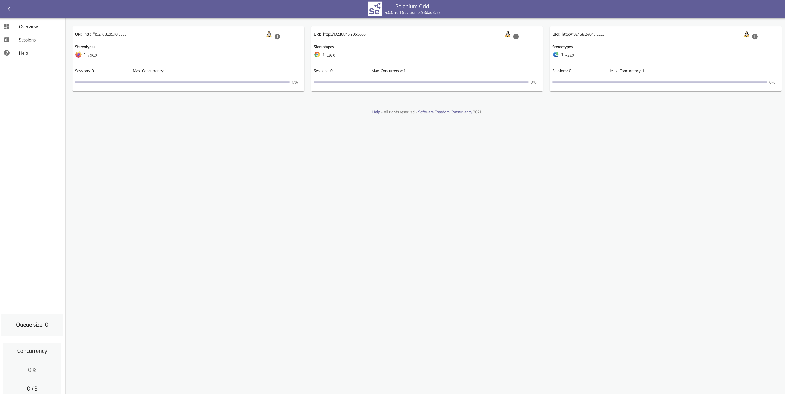

## Background
I've read and heard a lot about Selenium over the years, but never got my hands dirty. It's been on my 'todo' list for a fair while!

This blog topic is a good excuse to cover off a few learning points:
- Get an automated test running in a local k3d cluster to generate some traffic when testing progressive deployments with Argo-rollouts
- Investigate the options for running Selenium in K8s and how it can scale
- Write some Python!

## What is Selenium
Selenium was originally developed in 2004 as an internal web application test tool at ThoughtsWork. This was known as Selenium Core.
Selenium Grid was later developed for parallel testing and reduce the execution time. In 2006 Selenium Web Driver was added which facilitates a programmatic approach to creating the tests which can be interchangeably run across many browsers.


So Selenium covers a number of different projects:
- WebDriver: Uses browser automation APIs provided by the browser vendors to control and run tests as if being used by a real user
- IDE: Used to develop test cases. Chrome/Firefox extension to record browser using existing Selenium commands.
- Grid: Executing test cases on remote servers ( i.e. running on multiple browsers and operating systems)

## What are the options?
My first port of call was to check for existing frameworks or packages specifically for running Selenium on K8s. Maybe an existing Helm package or set of manifests.

This is where I discovered [Zalenium](https://github.com/zalando/zalenium) - A selenium Grid extension to scale a local grid dynamically with docker containers.\
But sadly this project is no longer under development. However this project does refer to a more popular and active project [Docker-Selenium](https://github.com/seleniumhq/docker-selenium/).\
Looking in the project issues I can see there is active work on a new Helm based deployment, but it doesnt appear to be fully complete yet, so I'll proceed with the Kubernetes manifests and modify with Kustomize where needed.

## The setup
 Taking the deployment manifest from [here](https://raw.githubusercontent.com/SeleniumHQ/docker-selenium/trunk/k8s-deployment-full-grid.yaml), I was able to setup a Kustomize deployment via ArgoCD to my local K3d cluster (Alternativly I could have just used ```kubectl apply -f k8s-deployment-full-grid.yaml```)

Deployment complete and all the pods are up and running...



For now will use port-forwarding to test. Will later either setup the ingress or trigger the test to run inside the cluster as part of a CI/CD pipeline with Argo Workflows:
```al
kubectl port-forward -n selenium-grid svc/selenium-router 4444:4444
```

Now to test the grid is in a ready state:
```al
http://localhost:4444/wd/hub/status
```
This should return a ready state of 'true' along with the status of each browser node.

Finally, all being well we can also check the UI:
```al
http://localhost:4444/ui/index.html#/
```
Looks good!



## Running a basic test
Now that I have the Grid running, I need some tests\
Beginning with some [basic tests in Python](https://github.com/kubernetes/examples/tree/master/staging/selenium#run-selenium-job-with-python). I'll check that the browser nodes are working:
```al
#!/usr/bin/python -tt

from selenium import webdriver
from selenium.webdriver.common.desired_capabilities import DesiredCapabilities

def check_browser(browser):
  driver = webdriver.Remote(
    command_executor='http://localhost:4444/wd/hub',
    desired_capabilities=getattr(DesiredCapabilities, browser)
  )
  driver.get("http://google.com")
  assert "google" in driver.page_source
  driver.quit()
  print("Browser %s checks out!" % browser)

check_browser("CHROME")
check_browser("FIREFOX")
# check_browser("EDGE")
```

The test completes successfully.\
Skipping Edge for now, it queues up looking for a Windows OS. Edge is now available on Linux, but I need to check on the required webdriver configuration.


## A slightly less basic test
Next for a test that does some form of interaction with a real website. Using an example from the [getting started page](https://selenium-python.readthedocs.io/getting-started.html)

```al
#!/usr/bin/python -tt

from selenium import webdriver
from selenium.webdriver.common.keys import Keys
from selenium.webdriver.common.desired_capabilities import DesiredCapabilities

def check_browser(browser):
  driver = webdriver.Remote(
    command_executor='http://localhost:4444/wd/hub',
    desired_capabilities=getattr(DesiredCapabilities, browser)
  )
  driver.get("http://www.python.org")
  assert "Python" in driver.title
  elem = driver.find_element_by_name("q")
  elem.clear()
  elem.send_keys("pycon")
  elem.send_keys(Keys.RETURN)
  assert "No results found." not in driver.page_source
  driver.close()


check_browser("CHROME")
check_browser("FIREFOX")
```

It runs!..........but gets stuck...

Debug time!

Using port-forwarding I can connect to the stuck test to see where it got to:
```al
kubectl port-forward -n selenium-grid selenium-ff-node-deployment-5cff5f865d-rdhqc 5900:5900
```
I can see the status of the test in the browser and it looks to have run.

Rerunning the test with ```driver.quit()``` instead of ```driver.close()``` seems to do the trick


---
## Reference
- https://www.selenium.dev/documentation/overview/
- https://www.blazemeter.com/blog/How-%20to-Scale-Selenium-Tests-in-a-Kubernetes-Cluster
- https://www.pingdom.com/solution/automated-browser-tests/
- https://medium.com/expedia-group-tech/da-kube-selenium-grid-using-kubernetes-docker-helm-and-traefik-856b802d1d08
- https://github.com/kubernetes/examples/tree/master/staging/selenium
- https://blog.testproject.io/2020/06/16/selenium-python-beginners-tutorial-for-automation-testing/
- https://www.programcreek.com/python/example/96012/selenium.webdriver.common.desired_capabilities.DesiredCapabilities.CHROME